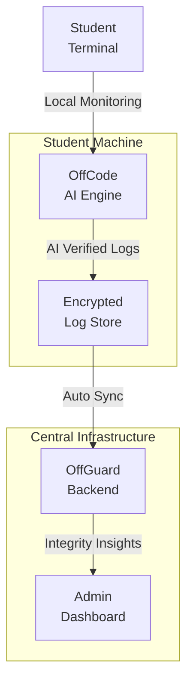

# OffGuard: AI-Assisted Integrity Monitoring for Digital Examinations

OffGuard is a distributed integrity monitoring engine designed to secure digital examinations in bandwidth-constrained and offline-prone environments. Unlike traditional proctoring solutions that rely on continuous video streaming and cloud processing, OffGuard decentralizes the monitoring layer, processing AI-verified events locally on exam machines.

## The Vision

Modern examination infrastructures are vulnerable to central points of failure: internet outages, server overloads, and privacy risks. OffGuard introduces a resilient "Offline-First" monitoring layer that ensures exam integrity persists even when the connection fails.

## Tech Stack

### Backend (The Coordination Layer)
- **Runtime:** Node.js (TypeScript)
- **Framework:** Express
- **Database:** PostgreSQL
- **Infrastructure:** Docker & Docker Compose
- **Security:** Hybrid AES-RSA encryption for payload delivery and log synchronization.

### Frontend (The Administration Portal)
- **Framework:** Next.js (TypeScript)
- **Styling:** Tailwind CSS
- **Desktop Wrapper:** Tauri (for secure lockdown browser capabilities and local system access)

### Intelligence (The OffCode Engine)
- **Language:** Python
- **Computer Vision:** YOLOv8 (Real-time object detection)
- **Logic:** Local AI modules for:
  - Multi-face detection
  - Mobile phone/Object detection
  - Audio anomaly analysis
  - Active window and process monitoring

## System Architecture

OffGuard acts as an intelligent middleware between students and exam platforms (e.g., Pearson VUE, TCS iON).



## Key Features

### 1. Offline Resilience
The monitoring engine continues to function during network outages. Integrity logs are generated and stored locally in a tamper-proof encrypted format, synchronizing automatically once connectivity is restored.

### 2. Privacy-Conscious Monitoring
Instead of full video surveillance, OffGuard records only "suspicious event" snippets and metadata. This significantly reduces personal data storage and protects student privacy while maintaining full auditability.

### 3. Distributed Bandwidth Optimization
By offloading AI processing to the student machine, OffGuard reduces cloud compute costs and eliminates the need for high-bandwidth video streaming across exam centers.

### 4. Security Architecture
- **Question Protection:** Question papers are AES-encrypted; the AES key is RSA-wrapped for specific exam centers.
- **Tamper-Proof Logs:** Every integrity event is hashed and digitally signed using SHA-256 to ensure non-repudiation.
- **Access Control:** Enforced via asymmetric key pairs, ensuring only authorized centers can decrypt exam material.

## Getting Started

### Prerequisites
- Docker & Docker Compose
- Python 3.10+ (for local engine development)
- Node.js 18+

### Quick Start (For dev):
1. **Clone the repository:**
   ```bash
   git clone https://github.com/Balamurugan1962/Vortex2.0.git
   ```

2. **Start the Backend Infrastructure:**
   ```bash
   docker-compose up -d
   ```

3. **Initialize the Local Engine:**
   Navigate to `/checker` and follow the setup instructions in the local requirements.

4. **Run the Local Engine:**
   ```bash
   cd checker
   python main.py
   ```

5. **Access the platform:**
   ```bash
   cd frontend
   npm install
   cd src-tauri
   npx tauri dev
    ```


---

## License
Internal project for secure digital examination infrastructure.
